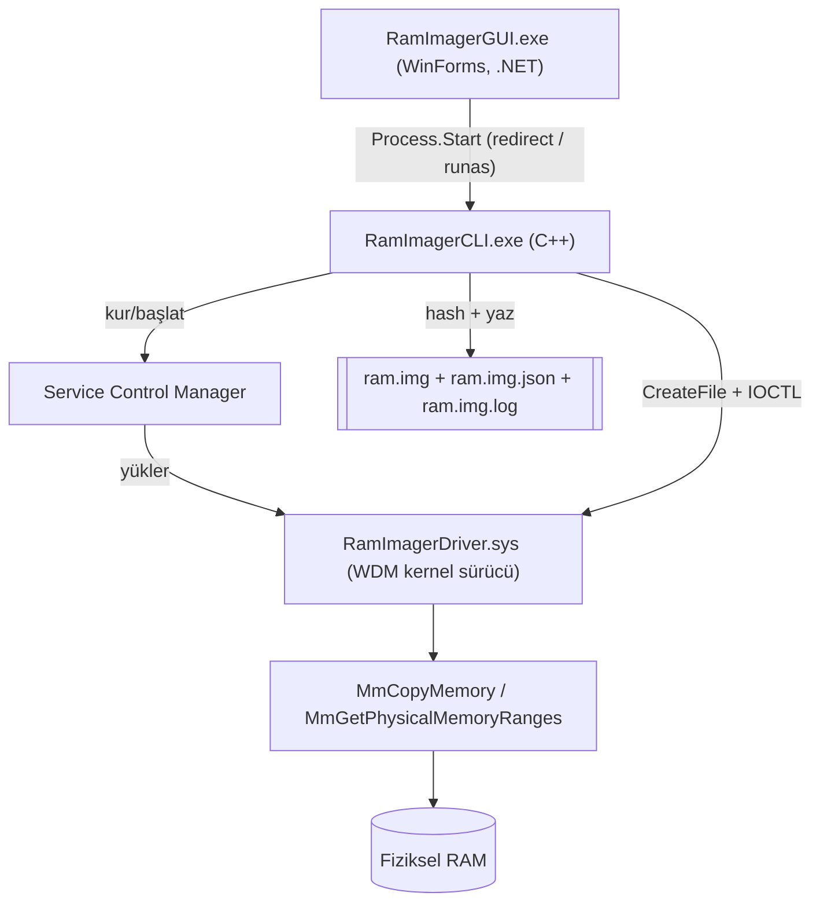

# RamImager - Proje Dokümanı

## 1. Amaç ve Kapsam

RamImager, FTK Imager'ın "Capture Memory" özelliğiyle aynı prensiple çalışan
bir **fiziksel bellek (RAM) görüntüleme** aracıdır. Proje iki tamamlayıcı
yetenek sunar:

1. **Tam fiziksel RAM görüntüleme** (`full` modu) — imzalı bir kernel sürücü
   aracılığıyla, adli bilişim/olay müdahale (DFIR) senaryoları için.
2. **Tek process bellek dökümü** (`process` modu) — sürücü gerektirmeyen,
   hızlı triage/test senaryoları için.

Kullanım amacı: yetkili sistemlerde adli inceleme, olay müdahale eğitimi ve
güvenlik araştırması. Bkz. [LEGAL.md](LEGAL.md).

## 2. Neden Kernel Sürücü Gerekiyor?

Windows XP SP2 / Server 2003 SP1'den beri `\Device\PhysicalMemory` bölüm
nesnesine kullanıcı modu erişimi tamamen kapatılmıştır. Bu yüzden FTK Imager,
WinPmem, Magnet RAM Capture, DumpIt gibi tüm gerçek "tam RAM" araçları aynı
deseni izler: kullanıcı modu uygulaması + imzalı kernel sürücü + IOCTL
protokolü. RamImager de bu mimariyi uygular (bkz. [ARCHITECTURE.md](ARCHITECTURE.md)).

## 3. Sistem Mimarisi



### Bileşenler

| Klasör | İçerik | Dil/Teknoloji |
|---|---|---|
| `common/` | Driver ↔ CLI arası paylaşılan IOCTL sözleşmesi (`ioctl.h`) | C header |
| `driver/` | Kernel sürücü kaynağı + doğrulanmış derleme betiği | C (WDM) |
| `imager/` | CLI uygulaması: servis kurulumu, driver IPC, hash, metadata, iki mod | C++17 |
| `gui/` | CLI'yi saran test arayüzü | C# / WinForms (.NET) |
| `scripts/` | Test signing, derleme, paketleme yardımcı betikleri | PowerShell |
| `docs/` | Mimari, derleme, kullanım, GUI, yasal ve bu proje dokümanı | Markdown |

## 4. Bileşen Detayları

### 4.1. `common/ioctl.h`

Driver ve CLI arasındaki tek sözleşme. Üç IOCTL tanımlar:

| IOCTL | Method | Amaç |
|---|---|---|
| `IOCTL_RAMIMAGER_GET_RANGE_COUNT` | METHOD_BUFFERED | Fiziksel bellek aralığı sayısı |
| `IOCTL_RAMIMAGER_GET_RANGES` | METHOD_BUFFERED | `RAMIMAGER_RANGE[]` (base + size) |
| `IOCTL_RAMIMAGER_READ_PHYSICAL` | METHOD_OUT_DIRECT | En fazla 4 MB'lık fiziksel bellek kopyası (`RAMIMAGER_MAX_CHUNK_SIZE`) |

### 4.2. `driver/src/driver.c` (WDM kernel sürücü)

- `DriverEntry`: `IoCreateDeviceSecure` ile SDDL `D:P(A;;GA;;;SY)(A;;GA;;;BA)`
  kullanarak cihazı yalnızca **SYSTEM ve yerel Administrators**'a açar.
- `RamImagerGetRanges`: `MmGetPhysicalMemoryRanges()` ile bellek haritasını okur.
- `RamImagerReadPhysical`: `MmCopyMemory(..., MM_COPY_MEMORY_PHYSICAL, ...)` ile
  fiziksel sayfaları güvenli şekilde kopyalar (okunamayan sayfada bugcheck yerine
  hata döner). Girdi uzunluğu sıfır/`RAMIMAGER_MAX_CHUNK_SIZE` üstü/çıktı
  arabelleğinden büyükse reddedilir (taşma/DoS koruması).
- `RamImagerUnload`: sembolik bağı ve cihazı temizler.

### 4.3. `imager/src/` (kullanıcı modu CLI)

| Dosya | Sorumluluk |
|---|---|
| `main.cpp` | CLI argüman ayrıştırma, elevation kontrolü, mod yönlendirme |
| `ServiceInstaller.*` | Sürücü servisini SCM API'leriyle kurar/başlatır/temizler |
| `DriverBridge.*` | Cihazı açar, IOCTL çağırır (aralıklar + fiziksel okuma) |
| `MemoryAcquisition.*` | `full` modunu uçtan uca yönetir: okuma döngüsü, zero-pad, hash, metadata |
| `ProcessDump.*` | `process` modu: `MiniDumpWriteDump` sarmalayıcısı |
| `Sha256.*` | Windows CNG (BCrypt) tabanlı SHA-256 (özel kripto kodu yazılmadı) |
| `Metadata.*` | `.img.json` sidecar dosyasını üretir (case, examiner, hash, aralıklar) |
| `Logger.h` | Zaman damgalı konsol/dosya günlüğü |

### 4.4. `gui/RamImagerGUI/` (test arayüzü)

- WinForms, `.NET`, tek `MainForm.cs` içinde programatik UI.
- Manifest `asInvoker` — GUI'nin tamamı yönetici çalışmaz; yalnızca `full`
  komutu gerektiğinde `ShellExecute` + `runas` ile ayrıca yükseltilir.
- Yükseltilmiş alt süreçten stdout yönlendirilemediği için (Windows kısıtı),
  `full` modda ilerleme CLI'nin ürettiği `.img.log` dosyası periyodik olarak
  okunarak (`TailLogFile`) gösterilir.
- `process` modunda doğrudan `Process` stdout/stderr redirection kullanılır.

## 5. Güvenlik Modeli

- Cihaz erişimi `IoCreateDeviceSecure` SDDL ile SYSTEM/Administrators'a kısıtlı.
- `IOCTL_RAMIMAGER_READ_PHYSICAL` istekleri: sıfır uzunluk, 4 MB üstü uzunluk,
  veya çıktı arabelleğinden büyük uzunluk reddedilir.
- Sürücü servisi her `full` çalıştırmasından sonra otomatik durdurulup silinir
  (kalıcı arka kapı bırakılmaz).
- Kripto (SHA-256) için özel kod yerine Windows CNG (BCrypt) kullanıldı.
- Okunamayan fiziksel sayfalar sıfırla doldurulur (bugcheck riski yok).

## 6. Geliştirme ve Doğrulama Süreci (bu ortamda gerçekten yapılanlar)

Bu proje sadece kod yazımından ibaret kalmadı; aşağıdaki adımlar **bu
ortamda gerçekten çalıştırılıp doğrulandı**:

1. **CLI derlemesi**: `cmake` + MSVC (VS2022 Professional) ile `RamImagerCLI.exe`
   temiz şekilde derlendi.
2. **`process` modu uçtan uca test**: çalışan bir PowerShell sürecinin belleği
   dump edildi → `selftest.dmp` (~271 MB) başarıyla üretildi.
3. **GUI derlemesi**: `dotnet build` ile `RamImagerGUI` derlendi; ilk denemede
   `net8.0-windows` hedefi makinede kurulu olmayan bir çalışma zamanı
   istediği için başlangıçta çöktü (Event Log'da doğrulandı: "You must
   install or update .NET"). `net10.0-windows`'a geçirilip yeniden derlendi,
   pencere gerçekten açıldı ve `Responding=True` olarak doğrulandı.
4. **WDK kurulumu**: `winget install Microsoft.WindowsWDK.10.0.26100` ile
   kurulu Windows SDK (10.0.26100.0) sürümüyle eşleşen WDK kuruldu.
5. **Sürücü derlemesi**: VS2022'de WDK'nın proje şablonu/PlatformToolset
   entegrasyonu kayıtlı çıkmadığı için, `cl.exe`/`link.exe`'yi WDK kernel-mode
   header/lib'leriyle doğrudan çağıran bir betik (`driver/build_driver.ps1`)
   yazıldı.
6. **Gerçek bir link hatası bulundu ve düzeltildi**: ilk link denemesinde
   `LNK2019: unresolved external symbol IoCreateDeviceSecure` hatası alındı.
   `dumpbin /linkermember` ile araştırıldı; sembolün gerçek adının
   `WdmlibIoCreateDeviceSecure` olduğu ve yalnızca `wdmsec.lib` içinde,
   `<wdmsec.h>` makrosu üzerinden eriştirildiği tespit edildi. `driver.h`'a
   `#include <wdmsec.h>` eklenerek düzeltildi.
7. **Sonuç**: `RamImagerDriver.sys` başarıyla üretildi; `dumpbin /headers` ile
   x64 makine tipi, Native subsystem ve geçerli entry point doğrulandı.
   Betik, temiz bir build ile tekrar çalıştırılarak tekrarlanabilirliği
   (reproducibility) doğrulandı.
8. **Paketleme betiği** (`scripts/package_release.ps1`) yazılıp çalıştırıldı;
   `dist\RamImager\` altında CLI + sürücü + GUI + `INSTALL.txt` başarıyla
   oluştu.

## 7. Bilinen Sınırlamalar

- `RamImagerDriver.sys` **imzasızdır**. Hedef makinede Secure Boot kapatma +
  test signing (`bcdedit /set testsigning on`) + reboot gerekir. Üretim için
  EV kod imzalama sertifikası + Microsoft attestation signing şarttır (bkz.
  [BUILD.md](BUILD.md)).
- Bu makinede WDK'nın Visual Studio proje şablonu/PlatformToolset entegrasyonu
  kayıtlı değildi; derleme bu yüzden manuel `cl`/`link` betiğiyle yapılıyor
  (VS "Empty WDM Driver" şablonu alternatif olarak BUILD.md'de belgelendi ama
  bu ortamda denenmedi).
- GUI, bu makinede kurulu olan `net10.0-windows` çalışma zamanını hedefler;
  farklı bir makinede farklı bir .NET sürümü kuruluysa `RamImagerGUI.csproj`
  içindeki `TargetFramework` güncellenip yeniden derlenmelidir.
- Sürücü yalnızca x64 için derlendi/test edildi (ARM64 denenmedi).

## 8. Dosya/Klasör Yapısı Referansı

```
common/ioctl.h                 Paylaşılan IOCTL sözleşmesi
driver/src/driver.c, driver.h  Kernel sürücü kaynağı
driver/build_driver.ps1        Doğrulanmış manuel derleme betiği
imager/src/*.cpp, *.h          CLI kaynağı
imager/CMakeLists.txt          CLI build tanımı
gui/RamImagerGUI/*.cs          GUI test arayüzü kaynağı
scripts/enable_test_signing.ps1  Test signing aç/kapat
scripts/build_imager.ps1         CLI'yi CMake ile derler
scripts/package_release.ps1      Dağıtım paketi oluşturur
docs/ARCHITECTURE.md           Teknik mimari (IOCTL, güvenlik, tasarım kararları)
docs/BUILD.md                  Adım adım derleme talimatı (doğrulanmış yöntem dahil)
docs/USAGE.md / KULLANIM_KILAVUZU.md   Kullanım kılavuzu (CLI + GUI)
docs/GUI.md                    GUI'ye özel kullanım notları
docs/LEGAL.md                  Yasal/etik kullanım çerçevesi
docs/PROJE_DOKUMANI.md         Bu doküman
```

## 9. Yasal ve Etik Çerçeve

Bu araç yalnızca üzerinde açık yetki bulunan sistemlerde, adli
bilişim/olay müdahale amacıyla kullanılmalıdır. Ayrıntılı kurallar ve
sorumluluk reddi için [LEGAL.md](LEGAL.md) dosyasına bakın.

## 10. Olası Sonraki Adımlar

- Gerçek EV/attestation imzası ile üretime uygun sürücü dağıtımı
- Sürücü için WHQL/HLK uyumluluk testleri
- ARM64 desteği
- GUI'de otomatik CLI/driver sürüm uyumluluk kontrolü
- Çoklu segment/parça (split image) desteği büyük RAM'ler için
